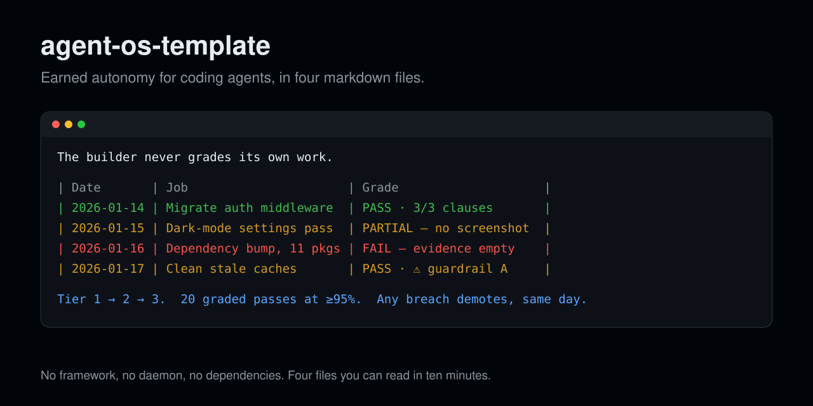

# agent-os-template



**Earned autonomy for coding agents, in four markdown files.** No framework, no daemon, no
dependencies. The point isn't automation — it's that *the decision to trust an agent becomes a
recorded one instead of a mood.*

> Use this template → drop it in your repo (or next to it) → point your agents at it.

## The problem it solves

You start out reading every diff. Then some of them. Then you notice you haven't actually
read one in a week, and you couldn't say when that changed or whether the agent earned it.

Trust drifted. Nothing recorded it. And the next time an agent does something expensive,
you'll have no idea whether it was out of character or the fourth time this month.

## The one idea

> **The builder never grades its own work.**

An agent that writes a task and then judges it will find it acceptable. That's not
dishonesty — it's the same context producing the same blind spot twice. So building and
grading are different sessions:

- **Manager** (you, or a builder agent) makes the thing.
- **Inspector** (`/inspect`, from a *different* session) reads the task's own verify step,
  checks the guardrails, and appends one line to the ledger.

Everything else here exists to make that split cheap enough to actually do.

## What's in the box

| File | What it does |
|---|---|
| **[AUTONOMY_LEDGER.md](AUTONOMY_LEDGER.md)** | One append-only line per agent job: date, job, runner, grade, evidence path |
| **[TIERS.md](TIERS.md)** | Three tiers per job type, a promotion rule (20 graded passes at ≥95%), and immediate demotion on any guardrail breach |
| **[GUARDRAILS.md](GUARDRAILS.md)** | Five starter guardrails. **Replace them with yours** — the inspector needs something concrete to grade against |
| **[skills/inspect/SKILL.md](skills/inspect/SKILL.md)** | The `/inspect` skill: find the verify step, grade each clause, check guardrails, append one line |

Four files. Read all of them in ten minutes.

## Setup

1. **Use this template** (green button) or copy the four files into your project.
2. **Rewrite `GUARDRAILS.md`.** This is the only required step. The defaults are a starting
   set, not a standard — a guardrail you can't imagine breaching is a slogan.
3. **Install the skill.** For Claude Code:
   ```sh
   mkdir -p ~/.claude/skills
   cp -r skills/inspect ~/.claude/skills/
   ```
   Or keep it project-local in `.claude/skills/`. Other agent runners: point yours at
   `skills/inspect/SKILL.md` — it's plain markdown instructions, not code.
4. **Delete the example rows** in the ledger once you have real ones.

## Using it

```sh
# after a task is finished — from a DIFFERENT session than the one that built it
/inspect
```

That's the loop. Build in one session, grade in another, and let the ledger accumulate.

## Three rules that make it work

**Ungraded work counts for nothing.** However well it went. The cost of promotion is the
discipline of grading; a job type nobody bothers to grade hasn't earned anything.

**No evidence means FAIL, not PARTIAL.** A task that produced no evidence did not produce a
verified result. "Verified" without a path someone can open is not verified.

**A breach counts even when nothing broke.** Near-misses are the only cheap lessons on offer.
Waiting for damage to teach you is how the expensive ones get learned.

## Honesty notes

**This is policy, not enforcement.** Nothing here can stop an agent doing anything. It is a
set of documents that make trust legible — which is a smaller claim than most agent-governance
tooling makes, and the reason this is four markdown files instead of a framework.

**Twenty graded passes is not a magic number.** It's large enough that a lucky streak won't
clear it, small enough to actually reach. Pick your own — but pick it *before* you start, not
on the day you're tempted to promote something.

**The tier table only helps if it can go down.** A table that only moves up is one nobody is
reading.

**Left out on purpose:** the setup this was extracted from also runs a daily health canary
(a scheduled check that the hooks still fire, disk is free, the ledger was updated this week).
That part is genuinely machine-specific, so it isn't in the template — but it's a good idea
and worth twenty lines of shell in your own environment.

## License

MIT — see [LICENSE](LICENSE).
